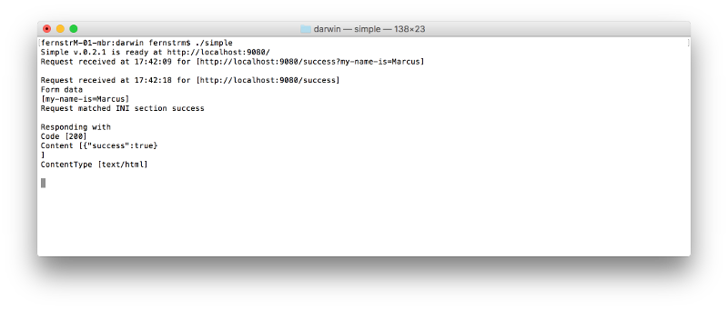

# Simple
Simple is a utility to easily run a webserver that dumps out data sent to it, and optionally responds based on an INI file.

## Usage
Download and unpack a release for your platform, current platforms are
* OSX (Darwin)
* Windows
* Linux

All releases are x64.

`./simple` to run it, or `./simple &` to run as a background process on OSX and Linux.

Data sent to `simple` is dumped to the terminal.

## INI file
You can specify endpoints and responses in the `simple.ini` file.

**Example**

```
[failure]
Content={"success":false}
ContentType=application/json
Header=Access-Control-Allow-Origin
HeaderValue=*
Code=400

[success]
Content={"success":true}
ContentType=application/json
Header=Access-Control-Allow-Origin
HeaderValue=*
Code=200
```

These endpoints are accessible at `localhost:9080/failure` and `localhost:9080/success` respectively.



Above is an example with first a GET and then a POST request.


## Copyright, author, and license
Copyright 2018 EAB Global, Inc.

Author Marcus Fernstrom on behalf of EAB Global, Inc.

MIT License